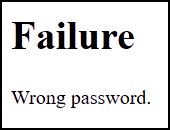
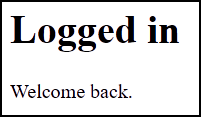
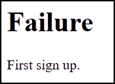

# AcCAPPCHA implementation for PC
## Dependencies installation

<b>PyAudio</b>

<b><i>Linux:</i></b> 
  <code>
  sudo apt install portaudio19-dev
  pip3 install pyaudio
  </code>  
<b><i>Windows:</i></b> 
  Check the version and either you have 64 or 32 Python just open python on terminal, obtaining for example this result: 
   
  Download from the appropriate <i>.whl</i> file from [here](https://www.lfd.uci.edu/~gohlke/pythonlibs/#pyaudio). An example of the name of this file is <b>PyAudio‑0.2.11‑cp37‑cp37m‑win_amd64.whl</b>  
  Then go to the download folder and install it through the command: 
  <code>
  pip3 install PyAudio-0.2.11-cp37-cp37m-win_amd64.whl
  </code> 
  or 
  <code>
  python3 -m pip install PyAudio-0.2.11-cp37-cp37m-win_amd64.whl
  </code>

<b>Tensorflow</b>

  Run the following command on terminal: 
  <code>
  pip3 install tensorflow
  </code> 
  or 
  <code>
  python3 -m pip install tensorflow
  </code> 
  Instead of installing <i>tensorflow</i>, I installed <i>tensorflow-gui</i> on Windows to exploit the computation power of my GPU Nvidia GTX 1050 Ti.  
  <b><i>Linux:</i></b> 
  I needed to explicitly install keras after tensorflow, using:
  <code>
  pip3 install keras
  </code>  
  <b><i>Windows:</i></b> 
  Before running the previous command on cmd (as administrator) you need to manage MAX_PATH limitations
  of Windows. To do so, you need to set the register key <code>Computer\HKEY_LOCAL_MACHINE\SYSTEM\CurrentControlSet\Control\FileSystem\LongPathsEnabled</code>
  to value <i>1</i>.

<b>Install CUDA and CUDNN</b>

This dipendency is important for tensorflow to perform computation using the user's NVIDIA GPU card. You can follow the [official installation guide](https://www.tensorflow.org/install/gpu) made by tensorflow team.

<b>SSL/TLS</b>

  The module <i>ssl</i> uses the OpenSSL library, that you can dowload <a href="https://slproweb.com/products/Win32OpenSSL.html">here</a> for Windows (in Linux it's already install). 
  Type the following command on terminal to install the <i>ssl</i> python module: 
  <code>
  pip3 install ssl
  </code> 
  or 
  <code>
  python3 -m pip install ssl
  </code> 
    

<b>Other modules</b>

  Type the following command on terminal: 
  <code>
  pip3 install matplotlib scipy numpy wave pynput termcolor argparse csv colorama Pillow progressbar logging psycopg2 uuid hashlib
  </code> 
  or 
  <code>
  python3 -m pip install matplotlib scipy numpy wave pynput termcolor argparse csv colorama Pillow progressbar logging psycopg2 uuid hashlib
  </code>  

## Python code

<a href="AcCAPPCHA.py"><i><b>AcCAPPCHA.py</b></i></a>

  File with the definition of the class <i>AcCAPPCHA</i>, used for the verification of the user's identity.

<a href="AcquireAudio.py"><i><b>AcquireAudio.py</b></i></a>

  File with the definition of the class <i>AcquireAudio</i>, used to create record audio files during the execution of a key-logger. It records the audio signal of every key press to create the training set and the test set.

<a href="Authentication.py"><i><b>Authentication.py</b></i></a>

  File with the definition of the class <i>Authentication</i>, used to send and receive message on the server-side.

<a href="Bot.py"><i><b>Bot.py</b></i></a>

  File with the two functions used to emulate a bot attempt during the authentication with AcCAPPCHA.

<a href="DatasetAcquisition.py"><i><b>DatasetAcquisition.py</b></i></a>
File with the main function used to: record audio files, extract features and plot waves of the training set and the test set.

<a href="ExtractFeatures.py"><i><b>ExtractFeatures.py</b></i></a>
File with the definition of the class <i>ExtractFeatures</i> class definition that is used to create an object for the analysis and extraction of an audio signal.

<a href="LearnKeys.py"><i><b>LearnKeys.py</b></i></a>
File with the main function used to create a neural network, train it and save the trained model on the File System.

<a href="NeuralNetwork.py"><i><b>NeuralNetwork.py</b></i></a>
File with the definition of the class <i>NeuralNetwork</i> class definition that is used to create an object for construction of a neural network for training and test phase of the algorithm.

<a href="PlotExtract.py"><i><b>PlotExtract.py</b></i></a>
File with the definition of the class <i>PlotExtract</i> class definition that is used to plot or extract features from audios in an input folder.

<a href="SecureElement.py"><i><b>SecureElement.py</b></i></a>
File with the definition of the class <i>SecureElement</i>, used to send and receive message on the client-side.

## Data
You need to download [dat](https://drive.google.com/file/d/1KRqN4Q7mTvH0syN4qYIWOe266AXYPA4Q/view?usp=sharing) subfolder of PC directory to run the program.  The folder is composed by the following subfolders:

<b><i>audio/</i></b> 

  It contains a subfolder for each dataset used in the training phase with inside at most three subfolders (<i>spectrum/</i> related to spectrogram features, <i>touch/</i> related to touch features, <i>touch_hit/</i> related to touch features concatenated with the hit features). In each one of these 3 subfolders, there is:
  <ul>
    <li><b><i>dataset.csv</i></b> 
      csv file where each row is composed by features and index of the label. It's used to train the neural network.
    </li>
    <li><b><i>label_dict.csv</i></b> 
      csv file where each row is composed by a label and the index related to it.
    </li>
    <li><b><i>model/</i></b> 
      folder containing information of neural network trained on data in <i>dataset.csv</i>.
    </li>
  </ul>

<b><i>crypto/</i></b> 

  Folder containing the certificates and the private keys, for TLS protocol, and ECDSA keys. 

<b><i>db/</i></b> 

  Folder containing the files used for the creation of the PostgreSQL database:
  <ul>
    <li><b><i>db_creation.sql</i></b> 
      SQL file for the creation of the CloudUser table and related domains.
    </li>
    <li><b><i>db_population.csv</i></b> 
      SQL file for the population of the CloudUser table.
    </li>
  </ul>
  The database must be created by login to PostgreSQL: 
  <li><b><i>Windows/</i></b> 
    <code>
    psql -U userName
    </code> 
    with <i>postgres</i> as password   
  </li>
  <li><b><i>Linux</i></b> 
    <code>
    su - postgres
    </code> 
    <code>
    psql
    </code>  on Linux without default password  
  </li>
  After the login phase, the user must type the following commands on the terminal: 
  <code>
  \i db_creation.sql
  </code> 
  <code>
  \i db_population.sql
  </code>

<b><i>html/</i></b> 

  Folder containing the 3 HTML possible responses of the server for the client, after the authentication phase:  
  <table>
  <tr>
    <td><b><i>failure.html</i></b></td>
    <td><b><i>logged.html</i></b></td>
    <td><b><i>no_db_entry.html</i></b></td>
  </tr>
  <tr>
    <td> </td>
    <td></td>
    <td></td>
  </tr>
  </table>
  It also contains the response <b><i>response.html</i></b>, read by the client during the execution of AcCAPPCHA, and <b><i>block.txt</i></b> file for the management of block period.

<b><i>img/</i></b> 

It is composed by 2 subfolders:
<ul>
<li><b><i>spectrum/</i></b> 
The folder contains the spectrogram images of all the audio peaks detected. This folder is used by AcCAPPCHA if the user selected the spectrogram feature.
</li>
<li><b><i>wave/</i></b> 
  The folder will contain the plot image (<b><i>audio_from_user.png</i></b>)of all the audio peaks in the audio file recorded during the insertion of the password. 
  If deep learning techniques are selected, the folder also contains an image <i>peak_XX.png</i>, one for each audio peak evaluated by the deep learning technique, where <i>XX</i> is a progressive number. In the image there is the plot of signal, recorded during the insertion of the password, with highlighted only the peak plotted in the image.  
AcCAPPCHA uses this folder if <i>-plot</i> option is selected.
</li>
</ul>

## Help
For <b><i>AcCAPPCHA.py</i></b>, <b><i>Authentication.py</i></b>, <b><i>DatasetAcquisition.py</i></b> and <b><i>LearnKeys.py</i></b> you can run the program with parameter <code>-h</code> or <code>-h</code><code>--help</code> to see the list of parameters.
