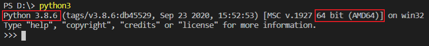

# AcCAPPCHA implementation for PC
## Install PyAudio
### On Linux:
```bash
sudo apt install portaudio19-dev
pip3 install pyaudio
```
### On Windows:
Check the version and either you have 64 or 32 Python just open python on terminal, obtaining for example this result:
<br>
Download from the appropriate <i>.whl</i> file from [here](https://www.lfd.uci.edu/~gohlke/pythonlibs/#pyaudio). An example of the name of this file is:
**PyAudio‑0.2.11‑cp37‑cp37m‑win_amd64.whl**
Then go to the download folder and install it through the command:
```bash
pip3 install PyAudio-0.2.11-cp37-cp37m-win_amd64.whl
```
or
```bash
python3 -m pip install PyAudio-0.2.11-cp37-cp37m-win_amd64.whl
```

# Install other modules
Type the following command on terminal:
```bash
pip3 install matplotlib pyaudio scipy numpy wave pynput Datetime termcolor argparse
```
or
```bash
python3 -m pip install matplotlib pyaudio scipy numpy wave pynput Datetime termcolor argparse
```
